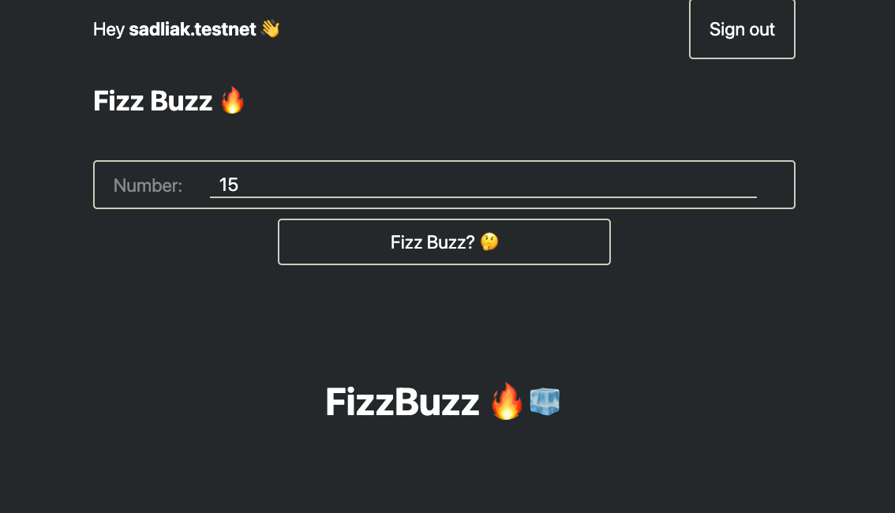

# NEARvember #11 (Tutorial)

# Write your own FizzBuzz NEAR smart contract with React frontend 🤩

This tutorial will teach you how to build your own **FizzBuzz NEAR smart contract** and create a web app front-end for
it!

This guide uses **AssemblyScript** for the NEAR smart contract and **React** for building the web app front-end.

## FAQ (Frequently Asked Questions)

### What is NEAR?

NEAR is an open-source and next-generation development platform built on
a [sharded](https://near.org/downloads/Nightshade.pdf), [proof-of-stake](https://en.wikipedia.org/wiki/Proof_of_stake),
[layer-one](https://blockchain-comparison.com/blockchain-protocols/) blockchain designed for usability.

You can learn more about NEAR on their [website](https://near.org).

### What is AssemblyScript?

AssemblyScript is a TypeScript-like language for WebAssembly. It basically allows you write your WASM code in a familiar
TypeScript syntax.

You can learn more about AssemblyScript on their [website](https://www.assemblyscript.org).

### What is React?

React is a JavaScript library for building user interfaces. It is probably the most popular pick and a go-to solution
for building web apps nowadays.

You can learn more about React on their [website](https://reactjs.org).

## Prerequisites

### NEAR account

You will need to create a NEAR account to be able to interact with the NEAR blockchain. Don't worry it won't cost you
anything since we will be using a NEAR **testnet**.

> NEAR testnet is a **special non-production version of the NEAR blockchain intended for testing and learning purposes**.

Let’s use NEAR wallet [website](https://wallet.testnet.near.org) to create a NEAR account:

* Navigate to https://wallet.testnet.near.org and click “Create Account” button
* Pick yourself an account ID (e.g. `near-to-the-moon.testnet`), which is basically your address in the NEAR blockchain,
  click "Reserve My Account ID" button
* Leave "Secure Passphrase" option picked and click "Continue" button
* Make sure to note down your secure passphrase and click "Continue"
* Answer passphrase verification question and click "Verify & Complete" button
* **That's it** ☑️

### CLI tools

For this tutorial you will need certain CLI tools installed on your machine. Follow the instructions in list below to
install them all:

* [node.js](https://www.nodejs.org) - 14.x.x+
    * Follow instructions to install [nvm](https://github.com/nvm-sh/nvm)
    * Run `nvm` commands
      ```console
      $ nvm install lts/fermium
      $ nvm use lts/fermium
      ```
* [yarn](https://yarnpkg.com/) - 1.22.x+
    ```console
    $ npm install -g yarn
    ```
* [near-cli](https://github.com/near/near-cli) - 3.x.x+
    ```console
    $ npm install -g near-cli
    ```

### NEAR CLI

Authorise your NEAR CLI to use your NEAR Wallet account (created in the section above). After running the command below
you will be redirected to the NEAR wallet [website](https://wallet.testnet.near.org).

```console
$ near login
```

Each account on NEAR can have at most one contract deployed to it. To overcome this limitation we can create subaccounts
on our NEAR account to have many contracts associated with our account.

```console
$ near create-account ch11.near-to-the-moon.testnet --masterAccount near-to-the-moon.testnet --initialBalance 5
```

## Project Setup

NEAR provides a simple way to set up a new project - [create-near-app](https://github.com/near/create-near-app). It
allows you to create project with either _AssemblyScript_ or _Rust_ for a smart contract code, and _React_, _Vue_ or
_"vanilla"-JS_ for a front-end. We will use **AssemblyScript** and **React**.

* Navigate to the folder where you want your project folder to be (e.g. `~/projects`)
    ```console
    $ cd ~/projects
    ```
* Set up a new project (it might take up to a few minutes to finish)
    ```console
    $ npx create-near-app --frontend=react nearvember-ch11
    ```
* Verify that the project was set up correctly via running it
    ```console
    $ cd nearvember-ch11
    $ yarn dev
    ```
* Navigate to http://localhost:1234 and check out **your own web app interacting with the NEAR blockchain**!
* Press `Ctrl + C` combination to exit the `yarn dev` command

## Explore the Code

The **"backend" (NEAR smart contract)** code lives in the `/contract` folder.

The **frontend (React)** code lives in the `/src` folder.

### Backend (NEAR smart contract)

Let's open `/contract/assembly/index.ts` file and review it.

In this file we are using NEAR SDK and importing libraries that help us to utilise NEAR contract capabilities.

```typescript
import {Context, logging, storage} from 'near-sdk-as'
```

Also, we export functions here, each of which then becomes a **smart contract method** that we could call either via
**NEAR CLI** or via **RPC endpoints** (which means that we could call them from our frontend too 🔥).

All outer-level file variables are stored in **smart contract storage** in the NEAR blockchain. We could either use
simple type variables (strings, booleans, numbers) or use more complex collections (e.g. `PersistentMap`
, `PersistentVector`, etc.) from NEAR SDK.

In the example `getGreeting()` smart contract method we are reading data from smart contract storage in NEAR blockchain
and in the `setGreeting()` - we are updating this data using the storage variable.

Check out [**NEAR AssemblyScript Reference:**](https://docs.near.org/docs/develop/contracts/as/intro#environment) for
more information.

### Frontend (React)

Let's open some files in `src` folder and review them.

* `src/config.js` - contains NEAR smart contract configuration, we will need to update `CONTRACT_NAME` variable here to
  point to our deployed smart contract to communicate with it (e.g. `ch11.near-to-the-moon.testnet`).
* `src/utils.js` - contains `initContract()` method that sets up NEAR smart contract RPC calls, we might want to
  update `viewMethods` and `changeMethods` to point to our smart contract methods.
* `src/App.js` - contains the React web app that interacts with the NEAR smart contract

## Update the Code

Let's update the example code to make it do **FizzBuzz** for us 🔥!

### Backend

Change your backend code in `/contract/assembly/index.ts` to something as simple as:

```typescript
export function fizzBuzz(number: i64): string {
    if (number % 15 === 0) {
        return 'FizzBuzz 🔥🧊️';
    }

    if (number % 5 === 0) {
        return 'Buzz 🧊️️';
    }

    if (number % 3 === 0) {
        return 'Fizz 🔥';
    }

    return 'NOTHING 💩';
}
```

### Frontend

Change `CONTRACT_NAME` variable in `src/config.js` to the previously created NEAR subaccount of your NEAR account:

```typescript
const CONTRACT_NAME = 'ch11.near-to-the-moon.testnet';
```

Change `viewMethods` and `changeMethods` arrays in `src/utils.js`:
```typescript
// Initializing our contract APIs by contract name and configuration
window.contract = await new Contract(window.walletConnection.account(), nearConfig.contractName, {
  // View methods are read only. They don't modify the state, but usually return some value.
  viewMethods: ['fizzBuzz'],
  // Change methods can modify the state. But you don't receive the returned value when called.
  changeMethods: [],
})
```

Install SASS:

```console
$ yarn add -D sass
```

Update styling in `src/global.css` (change file extension to `src/global.scss`):

```scss
* {
  box-sizing: border-box;
}

html {
  --bg: #fff;
  --fg: #25282A;
  --gray: #888;
  --royal: #0072CE;
  --blue: #6AD1E3;
  --primary: #D1CCBD;
  --secondary: var(--royal);
  --tertiary: #FF585D;

  background-color: var(--bg);
  color: var(--fg);
  font-family: -apple-system,BlinkMacSystemFont,Segoe UI,Roboto,Helvetica,Arial,sans-serif;
  font-size: calc(.65em + 0.7vw);
  line-height: 1.3;

  ::selection {
    background: var(--secondary);
    color: var(--bg);
  }

  @media (prefers-color-scheme: dark) {
    --bg: #25282A;
    --fg: #fff;
    --secondary: var(--blue);

    ::selection {
      background: var(--secondary);
      color: var(--fg);
    }
  }
}

body {
  margin: 0 auto;
  padding: 0 1em;
  max-width: 40em;
}

fieldset {
  border: none;
  margin: 0;
  padding: 0;
}

.highlight {
  align-items: center;
  display: flex;
  margin-bottom: 0.5em;
  width: 100%;
  label {
    margin-right: 0.5em;
  }
  input {
    caret-color: var(--secondary);
  }
}

label {
  color: var(--gray);
}

button, .highlight {
  border-radius: 5px;
  border-color: var(--primary);
  border: 0.1em solid var(--primary);
  padding: 0.5em 1em;

  &:hover, &:focus, &:focus-within {
    border-color: var(--secondary);
  }
}

input {
  border: none;
  flex: 1;
  &:read-only {
    color: var(--primary)
  }
}

input[type="number"] {
  text-align: center;
  border-bottom: 0.1em solid var(--primary);
  margin: 0 1em;
  width: 4em;
  padding-left: 0.5em;
  &:hover, &:focus {
    border-color: var(--secondary);
  }
}

button, input {
  background: transparent;
  color: inherit;
  cursor: pointer;
  font: inherit;
  outline: none;
}

button {
  position: relative;
  transition: top 50ms;
  &:hover, &:focus {
    top: -1px;
  }
  &:active {
    background: var(--secondary);
    border-color: var(--secondary);
    top: 1px;
  }
}

.is-premium {
  border-left: 0.25em solid var(--secondary);
  padding-left: 0.25em;
  margin-left: -0.5em;
}
```

Update `src/App.js`:

```typescript jsx
import 'regenerator-runtime/runtime';
import React from 'react';
import {login, logout} from './utils';
import './global.scss';

export default function App() {
    const [fizzBuzzNumber, setFizzBuzzNumber] = React.useState(null);
    const [fizzBuzzResponse, setFizzBuzzResponse] = React.useState('');

    const onClick = async () => {
        const response = await window.contract.fizzBuzz({number: `${fizzBuzzNumber}`});
        setFizzBuzzResponse(response);
    };

    // if not signed in, return early with sign-in prompt.
    if (!window.walletConnection.isSignedIn()) {
        return (
            <main>
                <h1>FizzBuzz 🔥</h1>
                <p style={{textAlign: 'center', marginTop: '2.5em'}}>
                    <button onClick={login}>Sign in</button>
                </p>
            </main>
        );
    }

    return (
        <>
            <div style={{display: 'flex', flexDirection: 'row', justifyContent: 'space-between'}}>
                <p>Hey <b>{window.accountId}</b> 👋</p>
                <button onClick={logout}>
                    Sign out
                </button>
            </div>
            <main>
                <div style={{display: 'flex', flexDirection: 'column'}}>
                    <h2>Fizz Buzz 🔥</h2>
                    <p className="highlight">
                        <label htmlFor="candidate">Number:</label>
                        <input
                            type="number"
                            autoComplete="off"
                            autoFocus
                            id="num"
                            required
                            onChange={(event => setFizzBuzzNumber(event.target.value))}
                            style={{textAlign: 'left'}}
                        />
                    </p>
                    <button disabled={fizzBuzzNumber == null}
                            style={{
                                margin: '0 10rem', ...((fizzBuzzNumber == null) && {
                                    cursor: 'not-allowed',
                                    pointerEvents: 'none',
                                    border: '1px solid #999999',
                                    backgroundColor: '#cccccc',
                                    color: '#666666'
                                })
                            }}
                            onClick={onClick}>
                        Fizz Buzz? 🤔
                    </button>
                    {fizzBuzzResponse.length !== 0 && <div style={{
                        display: 'flex',
                        flexDirection: 'column',
                        alignItems: 'center',
                        justifyContent: 'center',
                        marginTop: '4rem'
                    }}>
                        <p style={{width: '100%', fontSize: 'xxx-large', textAlign: 'center'}}>
                            {fizzBuzzResponse}
                        </p>
                    </div>}
                </div>
            </main>
        </>
    );
};
```

## Deploy your app

Build and deploy your app (NEAR smart contract and web app):

```console
$ yarn build
$ yarn deploy
```

## Done 🤩!

Congratulate yourself, now you should be able to login to your own **FizzBuzz NEAR smart contract** web app!


